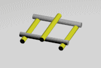

# Build A Bridge

**Subject Area: Engineering**

Learning Objectives: Students will be able to learn about basic construction principles. 

Materials Needed: One computer, one Micro or Micro+ 3D printer, and one 250ft PLA 3D Ink filament spool per 2-5 students.

Brief Description: Students will build Leonardo da Vinci’s self-supporting bridge out of 3D printed parts.

To Prepare: Students will need a computer that has the M3D software on it. We recommend one printer per every 2-5 students. The Micro or Micro+ 3D printer will need to be plugged into both the wall and the computer. Each printer will need to have a 250ft spool of PLA feeding into the external port. A spool holder is also recommended.

If you need assistance with any of the above please see our guides at support.printm3d.com.

You can either print the models to use ahead of time, or have the students print the model as part of the lesson. If you’d like students to print the model, follow the guidelines in our find and print lesson plan here:  https://support.printm3d.com/618643-Find--Print. You can find the model for this lesson here: [https://www.thingiverse.com/thing:204268](https://www.thingiverse.com/thing:204268) 

Lesson Plan:

1. Each pair or small group of students will need five smooth 3D printed beams and ten notched 3D printed beams to construct a simple self-supporting bridge. If you’d like, you can print more beams and ask students to construct more complicated bridges.
2. If you’d like, you can first ask students to attempt to construct their bridge without walking them through it. To walk them through it, follow the steps below.
3. Students should take two smooth beams and lay them parallel to each other. Then, take two notched beams and place them on top of the smooth beams to form a square. The smooth beams will fit inside the notches at either end of the notched beams, and the center notch should be facing up. Lay a single smooth beam over the center notch of both notched beams. See image 1 in the sequence below.
4. Then, students should take four more notched beams and place two of them on each side of the center beam, so the top notch is laying on the center beam and the middle notch is laying on the other two smooth beams. See image 2 in the sequence below.
5. Place another smooth beam across the open bottom notches of the two notched beams on the right side. Take two more notched beams and place the top notch on the middle smooth beam and the middle notch on the last smooth beam, as shown in image 3 in the sequence below. Repeat this step on the left side of the bridge with the remaining three beams to complete the bridge.

**Your finished bridge should look like this:**

